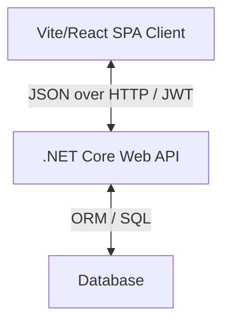
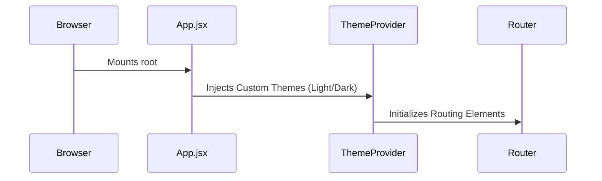
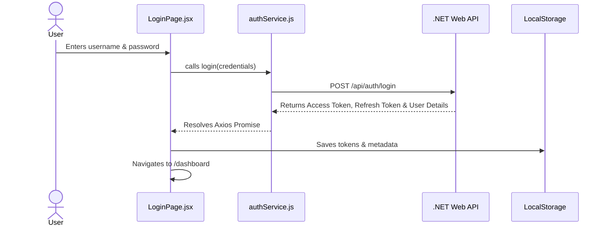
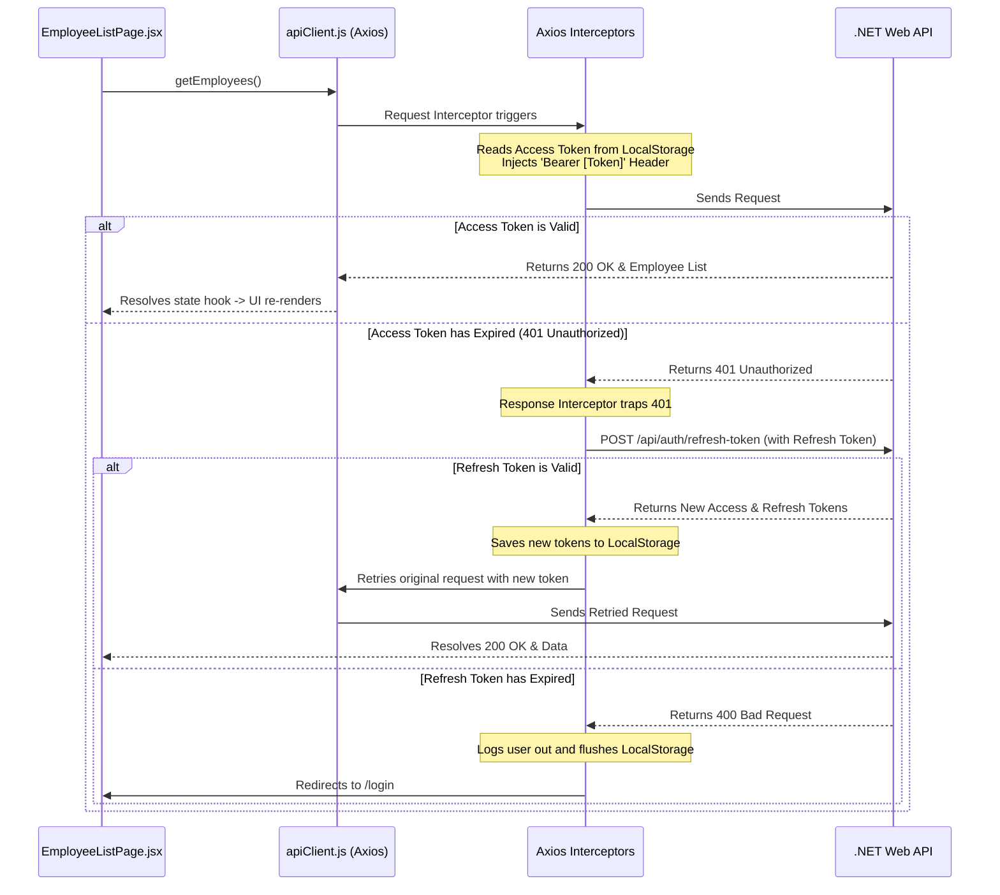

# Technical Documentation: Employee Portal Application

Welcome to the technical documentation for the **Employee Portal Frontend Application**. This document is designed to provide developers—both beginners and experienced engineers—with a comprehensive understanding of the application's architecture, data flows, core concepts, and styling conventions.

---

## 1. Application Overview

The Employee Portal is a modern, responsive Single Page Application (SPA) designed to manage employee directories and display department analytics. It interfaces with a secure backend API built using .NET Core.



### Main Features
*   **Role-Based Access Control (RBAC)**: Users are divided into **Admin** and **User** roles. Admins possess full CRUD permissions (Create, Read, Update, Delete) and CSV export access. Regular Users can view dashboards and list directories.
*   **Analytics Dashboard**: Visual summary statistics (Total Employees, Total Departments, Average Salary) combined with interactive bar charts depicting employee distributions across departments.
*   **Dynamic Theme Toggling**: Seamless transition between Light and Dark mode using custom palette presets.
*   **JWT Token Architecture**: Secure login, registration, token storage, and silent token refreshing on credentials expiry.
*   **Directory Management**: A paginated, filterable, and column-sortable interface for managing employee profiles.

---

## 2. Technical Flow

Understanding how data moves through the application is essential for maintaining and extending the code. The following outlines the end-to-end technical flow:

### 2.1 Bootstrapping and Mount
1.  **Entry Point**: The browser loads [index.html](file:///d:/Ashutosh/ReactDotNetCrudPro/employee-ui/index.html), which loads [main.jsx](file:///d:/Ashutosh/ReactDotNetCrudPro/employee-ui/src/main.jsx) as a module.
2.  **Mounting**: `main.jsx` targets the HTML DOM node `#root` and renders the `<App />` component.
3.  **App Setup**: [App.jsx](file:///d:/Ashutosh/ReactDotNetCrudPro/employee-ui/src/App.jsx) initializes the custom Material UI `<ThemeProvider>`, injects `<CssBaseline />` for global resets, reads the active theme (`light` or `dark`) from `localStorage`, and starts `<BrowserRouter>`.



### 2.2 End-to-End Authentication Flow


### 2.3 API Requests & Interceptor Flow
To interact with protected API endpoints, requests are routed through a configured Axios client that injects authorization headers. On token expiration, a response interceptor automatically handles token renewal.



---

## 3. Project Structure

Here is a look at the layout of the project's codebase:

```text
employee-ui/
├── index.html                  # HTML template & Font Loader
├── package.json                # Project dependencies & build scripts
├── vite.config.js              # Vite bundler options
├── src/
│   ├── main.jsx                # Application root mounting
│   ├── App.jsx                 # Routing, theme provider, and app structure
│   ├── index.css               # Global baseline styles & scrollbars
│   ├── theme.js                # Material UI premium light/dark themes
│   ├── components/             # Reusable UI components
│   │   ├── ConfirmDialog.jsx   # Generic confirmation modal
│   │   ├── DepartmentBarChart.jsx # Recharts visualization
│   │   ├── DepartmentSummaryTable.jsx # Table displaying summarized details
│   │   ├── Loader.jsx          # Circular loading indicator
│   │   ├── Navbar.jsx          # Glassmorphic header with user controls
│   │   ├── ProtectedRoute.jsx  # Route guards for authentication
│   │   └── SummaryCard.jsx     # Dashboard statistic badges
│   ├── pages/                  # Route view components
│   │   ├── ChangePasswordPage.jsx # Password update form
│   │   ├── DashboardPage.jsx   # Dashboard layouts and statistics
│   │   ├── EmployeeForm.jsx    # Add/Edit employee profile form
│   │   ├── EmployeeListPage.jsx # Paginated list of directory profiles
│   │   ├── LoginPage.jsx       # Login portal
│   │   └── RegisterPage.jsx    # User registration page
│   ├── services/               # API clients
│   │   ├── apiClient.js        # Interceptor-wrapped Axios instance
│   │   ├── authService.js      # Authentication endpoints helper
│   │   └── employeeService.js  # CRUD and dashboard query endpoints
│   ├── utils/                  # Utility scripts
│   │   ├── auth.js             # Token helpers (decode, save, delete)
│   │   └── fileDownload.js     # Blob CSV export helper
│   └── context/                # Shared states
│       └── LoaderContext.jsx   # Global load states
```

---

## 4. Techniques & Concepts Used

### 4.1 Theme Configuration & Dark Mode
*   **What**: The application defines light and dark variants of the MUI theme using `createTheme`. State transitions inside [App.jsx](file:///d:/Ashutosh/ReactDotNetCrudPro/employee-ui/src/App.jsx) trigger re-rendering of the `<ThemeProvider>`.
*   **Why**: Supporting dark modes prevents visual fatigue, aligns with modern software design guidelines, and improves readability.
*   **Example**: [theme.js](file:///d:/Ashutosh/ReactDotNetCrudPro/employee-ui/src/theme.js) contains overrides for standard MUI buttons and text fields to enforce consistent styling across modes:
    ```javascript
    export const lightTheme = createTheme({
      palette: {
        mode: "light",
        primary: { main: "#6366f1" },
        background: { default: "#f8fafc", paper: "#ffffff" }
      }
    });
    ```

### 4.2 React Hook: `useState`
*   **What**: Tracks dynamic state variables inside functional components, triggering UI updates when changed.
*   **Why**: State allows components to remember user interactions (like text inputs, selected page indexes, or loading conditions).
*   **Example**: Form state in [LoginPage.jsx](file:///d:/Ashutosh/ReactDotNetCrudPro/employee-ui/src/pages/LoginPage.jsx):
    ```javascript
    const [formData, setFormData] = useState({ username: "", password: "" });
    ```

### 4.3 React Hook: `useEffect`
*   **What**: Manages side-effects inside functional components, such as API data fetching, setting timers, or listening to window updates.
*   **Why**: Since rendering is pure, external operations like server calls must run outside the render cycle.
*   **Example**: Fetching employee data inside [EmployeeListPage.jsx](file:///d:/Ashutosh/ReactDotNetCrudPro/employee-ui/src/pages/EmployeeListPage.jsx):
    ```javascript
    useEffect(() => {
      loadEmployees();
    }, [loadEmployees]);
    ```

### 4.4 React Hook: `useCallback`
*   **What**: Memoizes a callback function, preventing it from being recreated on every component render unless its dependency array changes.
*   **Why**: Passing un-memoized functions as props or using them in `useEffect` dependency arrays can cause infinite loops or unnecessary re-renders of child components.
*   **Example**: Memoizing `loadEmployees` inside [EmployeeListPage.jsx](file:///d:/Ashutosh/ReactDotNetCrudPro/employee-ui/src/pages/EmployeeListPage.jsx):
    ```javascript
    const loadEmployees = useCallback(async () => {
      const response = await getEmployees(searchTerm, pageNumber, PAGE_SIZE);
      setEmployees(response.data.data.data);
    }, [searchTerm, pageNumber]);
    ```

### 4.5 React Hook: `useMemo`
*   **What**: Memoizes the result of an expensive calculation, recomputing it only when dependencies change.
*   **Why**: Sorting lists of rows can run on every render. `useMemo` ensures this sorting logic only runs when the array or sorting parameters actually change.
*   **Example**: Memoized sorting logic in [EmployeeListPage.jsx](file:///d:/Ashutosh/ReactDotNetCrudPro/employee-ui/src/pages/EmployeeListPage.jsx):
    ```javascript
    const sortedEmployees = useMemo(() => {
      const copied = [...employees];
      copied.sort((a, b) => compareValues(a, b, orderBy));
      return orderDirection === "asc" ? copied : copied.reverse();
    }, [employees, orderBy, orderDirection]);
    ```

### 4.6 Route Protection
*   **What**: Route-guarding wrappers (`PrivateRoute` and `AdminRoute`) that check user authentication status and role metadata before rendering child pages.
*   **Why**: Protects sensitive interfaces (like dashboards and management panels) from unauthorized or unauthenticated users.
*   **Example**: Guarding admin forms inside [App.jsx](file:///d:/Ashutosh/ReactDotNetCrudPro/employee-ui/src/App.jsx):
    ```javascript
    const AdminRoute = ({ children }) => {
      return isLoggedIn() && isAdmin() 
        ? children 
        : <Navigate to="/employees" replace />;
    };
    ```

---

## 5. Learner-Friendly Explanation

To help you understand this project, let's break down the core React concepts it uses:

### Component-Based Architecture
Think of components like LEGO blocks. The user interface is composed of small, independent blocks. For instance, the [SummaryCard](file:///d:/Ashutosh/ReactDotNetCrudPro/employee-ui/src/components/SummaryCard.jsx) is a block. Instead of writing code for three different cards, we write a single `SummaryCard` component and pass different properties (props) to it, like the title and value.

### Props vs. State
*   **Props (Properties)**: These are read-only configuration values passed down from parent components to children. Think of them like inputs passed to a function. For example, `SummaryCard` receives its `title` and `value` through props.
*   **State**: This is local, mutable memory kept inside a component. Think of it like a component's personal notebook. For example, [EmployeeForm.jsx](file:///d:/Ashutosh/ReactDotNetCrudPro/employee-ui/src/pages/EmployeeForm.jsx) uses state to track values typed into input fields.

### API Interceptors (The Concierge)
Imagine an Axios interceptor like a helpful building concierge:
1.  **Going out**: Every time you try to send a letter (an HTTP request), the concierge interceptor steps in and adds a security badge (the `Authorization: Bearer [JWT]` header) to the envelope.
2.  **Coming in**: If a package arrives returned with an "Expired Badge" error (401 Unauthorized), the concierge stops the failure, goes to the registry office to get a fresh badge (using the refresh token), swaps it, and sends the letter again. The component that sent the letter never needs to know any of this happened.

---

## 6. Benefits & Best Practices

### Benefits of the Implementation
1.  **Separation of Concerns**: API routes are abstracted into service files (like [employeeService.js](file:///d:/Ashutosh/ReactDotNetCrudPro/employee-ui/src/services/employeeService.js)). UI components focus on rendering rather than API request configurations.
2.  **Silent Token Management**: The refresh token cycle prevents users from being logged out unexpectedly, even when access tokens expire frequently (which is common in secure systems).
3.  **Visual Consistency**: Component styling is centralized through theme configurations ([theme.js](file:///d:/Ashutosh/ReactDotNetCrudPro/employee-ui/src/theme.js)) rather than inline style overrides.
4.  **Optimized Rendering**: Using `useMemo` and `useCallback` reduces unnecessary component re-renders, improving responsiveness.

### Areas for Improvement
*   **Centralized State Management**: If the application expands to include features like task lists or messaging, introducing a lightweight state manager (like Zustand or Redux Toolkit) would help manage global states more efficiently.
*   **Form Validation Library**: While standard validation works for simple inputs, using a library like Formik or React Hook Form with Zod would simplify complex form validation logic.

---

## 7. Conclusion

The Employee Portal frontend is a robust, theme-enabled React application. Its architecture demonstrates several production-ready design choices:

*   **Secure Route Controls** protect administration layouts based on user roles.
*   **Axios Interceptors** manage access token validation and renewal silently behind the scenes.
*   **Centralized MUI Customization** ensures a consistent visual style, supporting light/dark theme toggles smoothly.
*   **Performance Hooks** (`useMemo`, `useCallback`) help optimize interface responsiveness.
